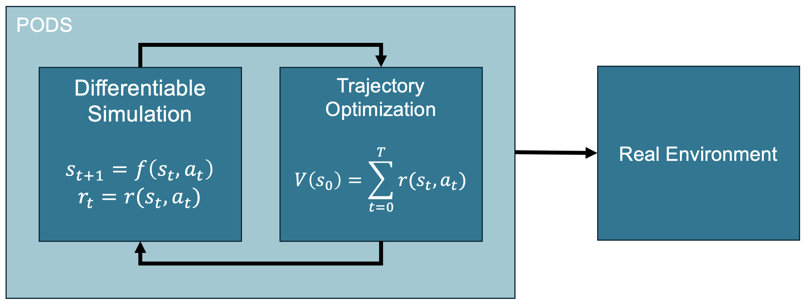
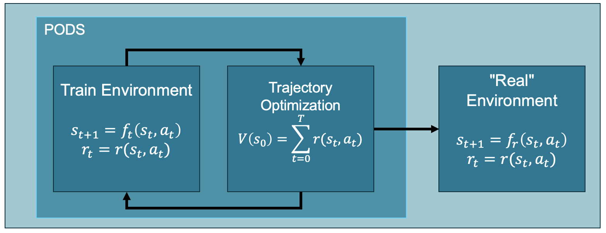
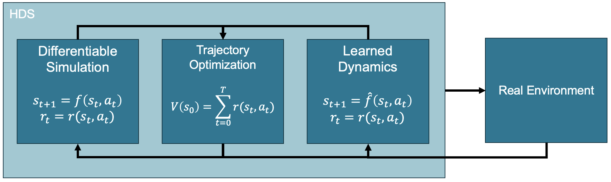

# Hybrid Differentiable Simulation: Improving Real-world Deployment through Data #

This repository was created for the course Foundations of Reinforcement Learning, held in the spring semester of 2024 at ETH Zurich. 

The purpose of this repository is three-fold:

1. It offers an open-source, parallelized implementation of <cite> Policy Optimization via Differentiable Simulation (PODS)</cite> [1] using <cite>JAX</cite> [2] and the <cite>BRAX</cite> [3] physics engine, since no such implementation is as of yet publicly available. 
2. To explore how well model-based reinforcement learning (particularly ones leveraging differentiable simulation) algorithms generalize to real world applications.
3. To explore whether using real-world data can mitigate the sim2real gap of said methods, as well as the known numerical stability issues that arise due to non-differentiable phenomena such as contact.

## Policy Optimization via Differentiable Simulation (PODS) ##

PODS is a model-based RL algorithm which leverages the power of being able to compute analytic gradients of the value function through the differentiable simulation. In essence, it is similar to the model-based approach back propagation through time (BPTT), which directly optimizes the policy parameters based on the analytic value function gradient. However, it distinguishes itself from BPTT by first performing trajectory optimization with respect to the sequence of actions and then using supervised learning with the improved action sequence as labels to improve the policy. This is, according to the authors, done to minimize numerical stability issues. Note that PODS requires a differentiable reward signal.

From our own experience, the algorithm has some shortcomings we hope to improve on.
1. Numerical instability during long rollouts and when contacts arise.
2. Ambiguity in handling termination conditions.
3. Convergence to local minima and limited exploration.

In terms of sim2real, the algorithm is open-loop. 

## Investigating the Sim2Real Gap ##
To roughly investigate the sim2real gap, we create two instances of the BRAX inverted pendulum with modified parameters. The "real" environment is currently only different from the "train" environment through friction: the "train" environment is frictionless, while the "real" environment has friction. 

## Hybrid Differentiable Simulation (HDS) ##

At its base, HDS takes after PODS. However, it does have some small modifications:
1. Gaussian noise added to policy outputs when collecting trajectory rollouts to improve exploration. This noise is decreased every epoch.
2. Simulated annealing for optimal step-size.

We close the loop by integrating real-world data in the form of a learned dynamics model. The goal here is to minimize the sim2real gap, and improve the deployment of robotic policies trained using these types of algorithms.

Currently, we are experimenting with using a pre-trained dynamics model and investigating whether sampling a fixed number of trajectories from the learned dynamics will:
1. Decrease the sim2real gap.
2. Improve numerical stability.

## Citations ##
[1] 
Mora, M.A.Z., Peychev, M., Ha, S., Vechev, M. &amp; Coros, S.. (2021). PODS: Policy Optimization via Differentiable Simulation. <i>Proceedings of the 38th International Conference on Machine Learning</i>, in <i>Proceedings of Machine Learning Research</i> 139:7805-7817 Available from https://proceedings.mlr.press/v139/mora21a.html.

[2] Bradbury, J., Frostig, R., Hawkins, P., Johnson, M. J., Leary, C., Maclaurin, D., Necula, G., Paszke, A., VanderPlas, J., Wanderman-Milne, S., & Zhang, Q. (2018). JAX: composable transformations of Python+NumPy programs (0.3.13) [Computer software]. http://github.com/google/jax

[3] Freeman, C. D., Frey, E., Raichuk, A., Girgin, S., Mordatch, I., & Bachem, O. (2021). Brax – A Differentiable Physics Engine for Large Scale Rigid Body Simulation.

